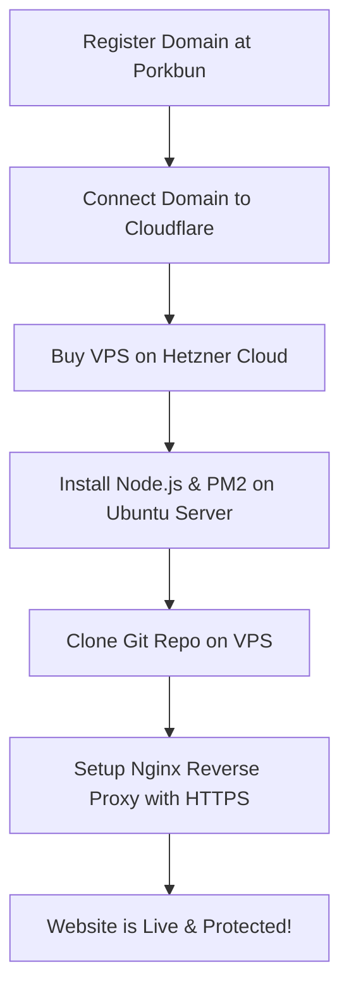

# Website Deployment and Hosting Research Report (Cheapest & Reliable)

Aapki Snapchat Downloader website ko custom domain ke sath live (publish) karne ke liye mukammal aur sabse sasti (cheapest) research niche di gayi hai. Is research mein traffic load (10k-20k daily visitors) aur video downloading ke bandwidth usage ko mad-de-nazar rakha gaya hai.

---

## 📊 1. Traffic aur Bandwidth ka Hisaab (Calculations)

Aapki website ek **video downloader** hai. Iska matlab hai ke jab log video download karenge to video ka data aapke server ke zariye flow hoga (backend proxy ke zariye). Isliye sabse ahem cheez **Bandwidth (Data Transfer)** hai. Niche iska mukammal calculation hai:

*   **Daily Visitors:** ~15,000 (Average)
*   **Average Video Size:** 5 MB (Snapchat spotlight aur stories aam tor par choti hoti hain)
*   **Downloads Per Visitor:** ~3 videos (Average)
*   **Daily Bandwidth:** 15,000 visitors × 3 downloads × 5 MB = **225 GB per day**
*   **Monthly Bandwidth (30 Days):** 225 GB × 30 = **6,750 GB (~6.75 Terabytes) per month**

> [!WARNING]
> Aam shared hosting (jaise Hostinger, Bluehost, Namecheap) par agar 6.75 TB data transfer ho, to wo aapki website ko **fauri tor par suspend** kar dete hain kyunke shared hosting par itna heavy load nahi chala sakte. Iske liye hume ek **VPS (Virtual Private Server)** chahiye hoga jiski bandwidth limits bohat zyada hon.

---

## 🛠️ 2. Kya Kya Cheezein Chahiye Hongi (Required Components)

Website ko professional aur bina kisi rukawat ke chalane ke liye niche di gayi 3 cheezein zaroori hain:

| Component Name | Kaam (Purpose) | Kahan se Milega (Best Provider) | Qeemat (Cheapest Price) |
| :--- | :--- | :--- | :--- |
| **1. Domain Name** | Website ka address (e.g., `snapdownloader.com`) | **Porkbun** ya **Cloudflare Registrar** | **~$9.73 / year** (approx. 2,700 PKR) |
| **2. VPS Server** | Node.js backend ko 24/7 chalane ke liye cloud computer | **Hetzner Cloud** ya **Contabo** | **~€5.00 - €8.00 / month** (approx. 1,500 - 2,500 PKR) |
| **3. CDN & SSL** | DDoS protection, Free HTTPS Certificate, aur caching | **Cloudflare (Free Plan)** | **100% FREE** |

---

## 💰 3. Sub se Saste aur Behtareen Providers (Detailed Research)

### 🌐 A. Domain Name (Cheapest Registrar)
Domain lene ke liye sabse sasti aur behtareen jagah **Porkbun** ya **Cloudflare Registrar** hai.
*   **Porkbun:** `.com` domain sirf **$9.73 per year** mein milta hai. Iski renewal price bhi boht kam hoti hai ($10.37) aur isme **Free WHOIS Privacy Protection** milti hai (taake koi aapka phone number aur email na dekh sake).
*   **Avoid GoDaddy:** GoDaddy shuru mein $1.99 ka domain deta hai lekin agle saal renewal $22+ charge karta hai aur privacy ke alag paise leta hai.

### 🖥️ B. VPS Server (Cheapest High-Bandwidth Hosting)
Aapki site ke liye normal VPS provider (AWS, DigitalOcean, Linode) boht mehnge parenge kyunke wo 1TB ke baad har 1GB ka $0.01 charge karte hain (6.75 TB ka bill $60+ ban jayega). Isliye sabse behtareen 2 options hain:

#### 1. Hetzner Cloud (Highly Recommended 🌟)
Hetzner Germany ka sabse purana aur behtareen provider hai. Inki speed aur hardware lajawab hai.
*   **Plan:** **CX23** (2 vCPU, 4 GB RAM, 40 GB NVMe SSD)
*   **Bandwidth:** **20 TB (20,000 GB) Free Included!** (Aapki requirement 6.75 TB hai, to 20 TB bohat zyada hai!)
*   **Qeemat:** **~€4.80 - €5.50 per month** (Lagbhag 1,500 PKR/month).
*   **Fayda:** Ryzen processors hain jis se bulk-video scraping aur zip compression boht tez hogi. Snapchat inki German IPs ko jaldi block nahi karta.

#### 2. Contabo VPS
Contabo bhi Germany ka sasta hosting provider hai jo boht heavy resources deta hai.
*   **Plan:** **VPS S** (4 vCPU, 8 GB RAM, 50 GB NVMe)
*   **Bandwidth:** **32 TB (32,000 GB) Free Included!**
*   **Qeemat:** **~€6.50 - €8.00 per month** (Lagbhag 2,000 PKR/month).
*   **Fayda:** Ram aur CPU boht zyada milte hain, lekin inka disk I/O thora slow hota hai Hetzner ke mukable mein.

### 🛡️ C. Cloudflare (Free CDN & Security)
Hame apni website ko direct VPS se connect nahi karna, balke darmiyan mein **Cloudflare** lagana hai.
*   **Kaam:**
    1.  **DDoS Protection:** Agar koi dushman ya hacker website par fake traffic bhej kar crash karna chahe to Cloudflare use rok dega.
    2.  **IP Hiding:** Snapchat ko aapke real VPS ka IP pata nahi chalega, jis se server ke block hone ka khatra na hone ke barabar ho jata hai.
    3.  **Caching:** HTML, CSS aur JS files Cloudflare khud save kar leta hai. Jab user site kholay ga, to server par load nahi parega, site super-fast load hogi.
    4.  **Free SSL:** Free HTTPS padlock milega jo security ke liye zaroori hai.

---

## 📈 4. Kul Monthly Kharcha (Total Cost Estimate)

Agar hum sabse behtareen aur safe setup lagayein:

1.  **Domain (.com):** ~$9.73 (Saalana kharcha, yani **~$0.80 per month**)
2.  **Hetzner VPS (CX23):** ~€5.00 (Yani **~$5.40 per month**)
3.  **Cloudflare Security:** **$0.00**
4.  **Total Monthly Estimate:** **~$6.20 per month** (Lagbhag **1,700 - 1,800 PKR** monthly kharcha).

> [!TIP]
> Sirf **1,800 PKR monthly** mein aap aisi website chala sakte hain jo daily ke 20,000 visitors ka load bina kisi hang ya crash ke sambhal sake! Ye poori market mein sabse sasta aur 100% professional tarika hai.

---

## 🚀 5. Website Deploy Kaise Hogi (Step-by-Step Action Plan)

Website ko VPS par live karne ke liye niche diye gaye steps follow kiye jayenge:



### Steps ki details:
1.  **Step 1: Domain Kharidna:**
    Porkbun par ja kar apna manpasand domain search karein aur use kharid lein (Credit/Debit card se payment ho jati hai).
2.  **Step 2: Cloudflare Setup:**
    Cloudflare par free account banayein. Apne domain ke Name Servers ko Porkbun se badal kar Cloudflare wale kar dein.
3.  **Step 3: Hetzner VPS Setup:**
    Hetzner Cloud par account banayein. Aik naya Server create karein (OS select karein: **Ubuntu 22.04 LTS**).
4.  **Step 4: Server Environment Setup:**
    Server mein login ho kar Node.js aur Git install karenge:
    ```bash
    sudo apt update
    sudo apt install nodejs npm git -y
    ```
5.  **Step 5: Code Deploy aur PM2:**
    Aapka GitHub repository code VPS par clone karenge aur **PM2 (Process Manager)** install karenge taake website background mein 24/7 chalti rahe aur server restart hone par automatically on ho jaye:
    ```bash
    sudo npm install -g pm2 tsx
    pm2 start server.ts --interpreter tsx
    ```
6.  **Step 6: Nginx Reverse Proxy:**
    **Nginx** server configure karenge jo Cloudflare se aane wali requests ko humare Node.js port (`3000`) par bejhega.

---

## 🛡️ 6. Koi Masla Na Aane Dene Ke Liye Safe Tips (Best Practices)

1.  **Rate Limiting:** Humne code mein pehle hi `express-rate-limit` lagaya hua hai. Ye kisi ek user ko boht zyada automatic requests bhej kar server block karne se rokta hai.
2.  **Snapchat Block Protection (Proxies):** Snapchat aam tor par IP block kar deta hai agar ek hi server se hazaaron videos download hon. Iske liye hum backup mein free ya cheap proxies use kar sakte hain agar future mein zaroorat pari (ab tak humara single server system behtareen chal raha hai).
3.  **PM2 Auto-Restart:** PM2 tool agar backend crash bhi ho jaye to use microsecond mein auto-restart kar deta hai. Users ko kabhi pata bhi nahi chalega ke peeche koi crash hua tha.

Aap jab bhi apna domain aur server buy karne ke liye tayar hon, mujhe batayein. Main aapko step-by-step servers configure kar ke, domain point kar ke live kar dunga!
